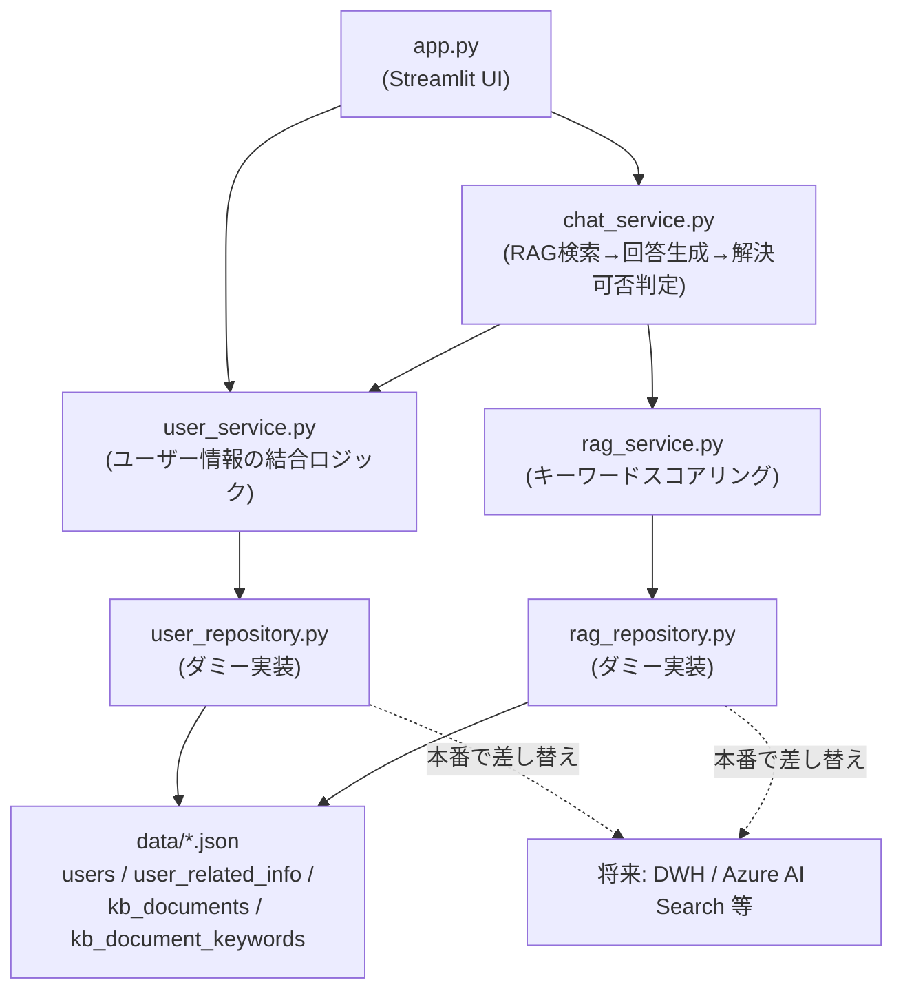

# Streamlit サンプル集

## セットアップ

プロジェクトルートで依存関係をインストールします。

```bash
poetry install
```

## サンプル一覧

### basic_widgets — 基本ウィジェット一覧

Streamlit の主要なウィジェットを1ページにまとめたサンプルです。

```bash
poetry run streamlit run samples/basic_widgets/app/app.py
```

### multipage_app — マルチページアプリ

`st.navigation` + `st.Page` による3ページ構成(Home / Data View / Form)のサンプルです。

```bash
poetry run streamlit run samples/multipage_app/app/app.py
```

### dashboard — データ分析ダッシュボード

同梱のサンプル売上データ(`samples/dashboard/app/data/sales_sample.csv`)を使ったダッシュボードです。
サイドバーで期間・カテゴリ・地域を絞り込めます。

```bash
poetry run streamlit run samples/dashboard/app/app.py
```

サンプルデータを作り直す場合は以下を実行してください。

```bash
poetry run python samples/dashboard/app/generate_data.py
```

### chat_support — RAGチャットサポートUI

サポートポータルを模したチャットUIのサンプルです。ユーザー向けの初期メッセージ・関連情報を表示した後、
チャットで商品・サービスについて問い合わせると、ダミーのナレッジベースを検索して回答します。
AIだけでは回答できない質問には、問い合わせ窓口への案内を表示します。

UI(`app.py`)とロジック(`services/` の `chat_service.py` / `user_service.py` / `rag_service.py`)を分離しており、
Service層はStreamlitに依存しないため、将来的にFastAPI等へ置き換えやすい構成になっています。

本来ログイン認証から取得する想定のユーザーIDは、デモでは環境変数 `CHAT_SUPPORT_USER_ID` から取得します。
未設定の場合はデフォルト値にフォールバックせず、画面上にその旨を明示してエラー表示します。

#### アーキテクチャ



ダミーデータ(`app/data/*.json`)はDWH(データウェアハウス)のディメンション/ファクトテーブルを模し、
`users` / `user_related_info` / `kb_documents` / `kb_document_keywords` に分割・正規化しています
(`updated_at` / `source_system` といったメタ列を含む)。

このダミーデータへのアクセス処理は `user_repository.py` / `rag_repository.py` に切り出しており、
`user_service.py` / `rag_service.py` は外部キー(`user_id` / `document_id`)で結合してドメインモデルを
組み立てるロジックに専念しています。本番でデータ取得元をDWH等へ差し替える際は、この2つの
`*_repository.py` だけを差し替えれば済み、Service層以降のコードは変更不要な想定です。

```bash
CHAT_SUPPORT_USER_ID=user-001 poetry run streamlit run samples/chat_support/app/app.py
```
