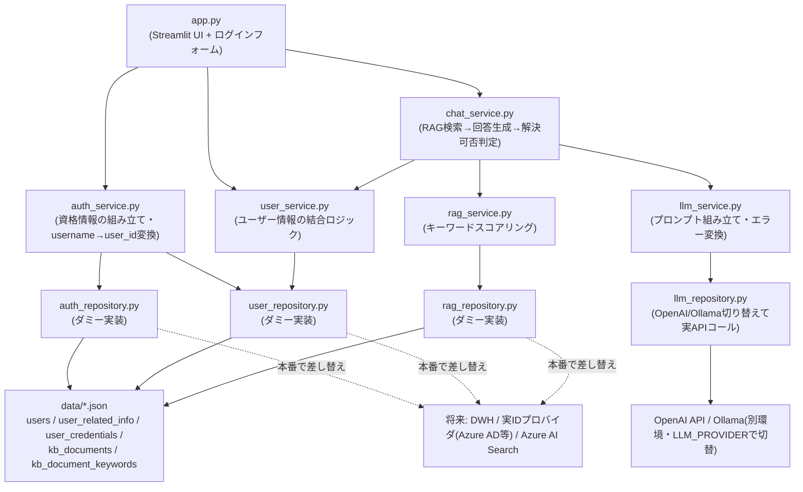

# Streamlit サンプル集

## セットアップ

プロジェクトルートで依存関係をインストールします。

```bash
poetry install
```

## サンプル一覧

### basic_widgets — 基本ウィジェット一覧

Streamlit の主要なウィジェットを1ページにまとめたサンプルです。

```bash
poetry run streamlit run samples/basic_widgets/app/app.py
```

### multipage_app — マルチページアプリ

`st.navigation` + `st.Page` による3ページ構成(Home / Data View / Form)のサンプルです。

```bash
poetry run streamlit run samples/multipage_app/app/app.py
```

### dashboard — データ分析ダッシュボード

同梱のサンプル売上データ(`samples/dashboard/app/data/sales_sample.csv`)を使ったダッシュボードです。
サイドバーで期間・カテゴリ・地域を絞り込めます。

```bash
poetry run streamlit run samples/dashboard/app/app.py
```

サンプルデータを作り直す場合は以下を実行してください。

```bash
poetry run python samples/dashboard/app/generate_data.py
```

### chat_support — RAGチャットサポートUI

サポートポータルを模したチャットUIのサンプルです。ユーザー向けの初期メッセージ・関連情報を表示した後、
チャットで商品・サービスについて問い合わせると、ダミーのナレッジベースをキーワード検索し、ヒットした
情報を根拠にLLM(OpenAI または Ollama)が回答を生成します。ナレッジベースで回答できない質問には、
問い合わせ窓口への案内を表示します。

LLMの呼び出し先は `LLM_PROVIDER` 環境変数で `openai` / `ollama` を切り替えられます。Ollamaはこの
リポジトリ内には環境を用意せず、別環境で起動しているサーバーへHTTP接続する想定です(OpenAI互換の
`/v1/chat/completions` エンドポイントを利用)。

UI(`app.py`)とロジック(`services/` の `chat_service.py` / `user_service.py` / `rag_service.py` /
`llm_service.py` / `auth_service.py`)を分離しており、Service層はStreamlitに依存しないため、将来的に
FastAPI等へ置き換えやすい構成になっています。

ログインには [`streamlit-authenticator`](https://github.com/mkhorasani/Streamlit-Authenticator) を使用し、
以下のテストアカウントでログインできます(パスワードはbcryptでハッシュ化して保存)。

| ユーザー名 | パスワード | 対応ユーザー(user_id) |
|---|---|---|
| `hoge` | `demo-pass-001` | hoge(user-001) |
| `fuga` | `demo-pass-002` | fuga(user-002) |

#### アーキテクチャ



ダミーデータ(`app/data/*.json`)はDWH(データウェアハウス)のディメンション/ファクトテーブルを模し、
`users` / `user_related_info` / `user_credentials` / `kb_documents` / `kb_document_keywords` に
分割・正規化しています(`updated_at` / `source_system` といったメタ列を含む)。

このダミーデータへのアクセス処理は `auth_repository.py` / `user_repository.py` / `rag_repository.py`
に切り出しており、`auth_service.py` / `user_service.py` / `rag_service.py` は外部キー(`user_id` /
`username` / `document_id`)で結合してドメインモデルを組み立てるロジックに専念しています。本番で
データ取得元をDWHや実IDプロバイダへ差し替える際は、`*_repository.py` だけを差し替えれば済み、
Service層以降のコードは変更不要な想定です。

#### 環境変数

LLMの呼び出しには以下の環境変数が必要です。未設定・不正値の場合はアプリ起動時にエラーになります
(意図的なフェイルファストであり、デフォルト値で黙って動き続けることはありません)。

| 変数 | 必須条件 | 説明 |
|---|---|---|
| `LLM_PROVIDER` | 常に必須 | `openai` または `ollama` |
| `OPENAI_API_KEY` | `LLM_PROVIDER=openai` のとき必須 | OpenAI のAPIキー |
| `OPENAI_MODEL` | `LLM_PROVIDER=openai` のとき必須 | 使用するOpenAIモデル。例: `gpt-4o-mini` |
| `OLLAMA_BASE_URL` | `LLM_PROVIDER=ollama` のとき必須 | 例: `http://localhost:11434/v1`(別環境で起動済みのOllama) |
| `OLLAMA_API_KEY` | `LLM_PROVIDER=ollama` のとき必須 | OpenAI SDKの必須パラメータを満たすための値(ダミー値をコードに埋め込まない方針のため、値そのものは呼び出し先のOllama環境の設定に合わせる) |
| `OLLAMA_MODEL` | `LLM_PROVIDER=ollama` のとき必須 | 使用するOllamaモデル。例: `llama3.1` |

いずれもコード側に既定値は持たせていません(未設定は暗黙にフォールバックさせず、必ずエラーにする方針のため)。

```bash
# OpenAIを使う場合
LLM_PROVIDER=openai OPENAI_API_KEY=sk-... OPENAI_MODEL=gpt-4o-mini poetry run streamlit run samples/chat_support/app/app.py

# Ollama(別環境で起動済み)を使う場合
LLM_PROVIDER=ollama OLLAMA_BASE_URL=http://localhost:11434/v1 OLLAMA_API_KEY=ollama OLLAMA_MODEL=llama3.1 poetry run streamlit run samples/chat_support/app/app.py
```

環境変数はコマンドラインで指定する代わりに、`samples/chat_support/.env`(`.env.example` をコピーして
値を埋めたもの、`.gitignore` 対象)に書いておくこともできます。`app.py` が起動時に読み込みます。
