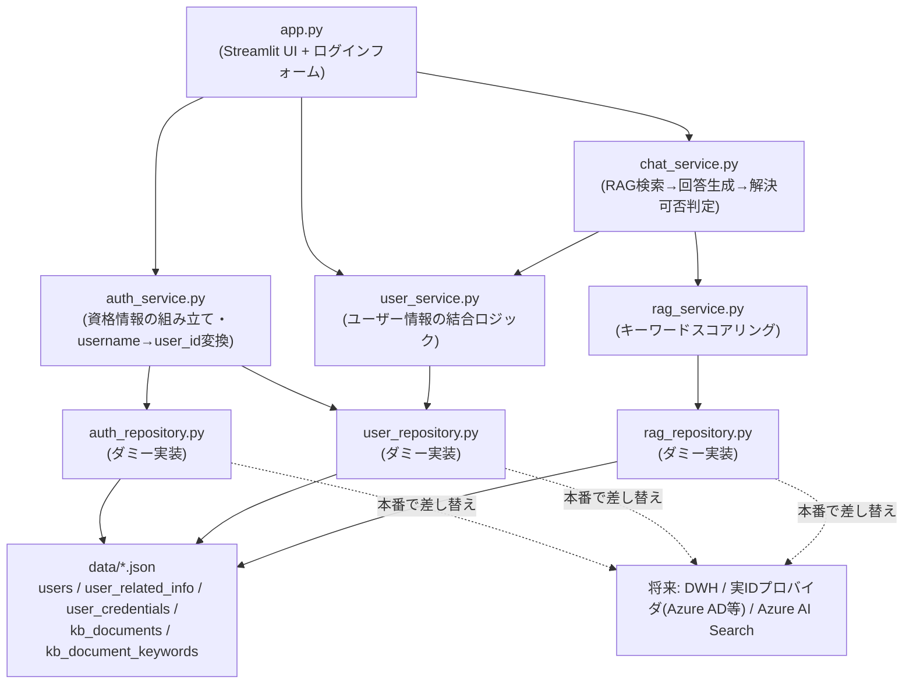

# Streamlit サンプル集

## セットアップ

プロジェクトルートで依存関係をインストールします。

```bash
poetry install
```

## サンプル一覧

### basic_widgets — 基本ウィジェット一覧

Streamlit の主要なウィジェットを1ページにまとめたサンプルです。

```bash
poetry run streamlit run samples/basic_widgets/app/app.py
```

### multipage_app — マルチページアプリ

`st.navigation` + `st.Page` による3ページ構成(Home / Data View / Form)のサンプルです。

```bash
poetry run streamlit run samples/multipage_app/app/app.py
```

### dashboard — データ分析ダッシュボード

同梱のサンプル売上データ(`samples/dashboard/app/data/sales_sample.csv`)を使ったダッシュボードです。
サイドバーで期間・カテゴリ・地域を絞り込めます。

```bash
poetry run streamlit run samples/dashboard/app/app.py
```

サンプルデータを作り直す場合は以下を実行してください。

```bash
poetry run python samples/dashboard/app/generate_data.py
```

### chat_support — RAGチャットサポートUI

サポートポータルを模したチャットUIのサンプルです。ユーザー向けの初期メッセージ・関連情報を表示した後、
チャットで商品・サービスについて問い合わせると、ダミーのナレッジベースを検索して回答します。
AIだけでは回答できない質問には、問い合わせ窓口への案内を表示します。

UI(`app.py`)とロジック(`services/` の `chat_service.py` / `user_service.py` / `rag_service.py` /
`auth_service.py`)を分離しており、Service層はStreamlitに依存しないため、将来的にFastAPI等へ置き換え
やすい構成になっています。

ログインには [`streamlit-authenticator`](https://github.com/mkhorasani/Streamlit-Authenticator) を使用し、
以下のテストアカウントでログインできます(パスワードはbcryptでハッシュ化して保存)。

| ユーザー名 | パスワード | 対応ユーザー(user_id) |
|---|---|---|
| `hoge` | `demo-pass-001` | hoge(user-001) |
| `fuga` | `demo-pass-002` | fuga(user-002) |

#### アーキテクチャ



ダミーデータ(`app/data/*.json`)はDWH(データウェアハウス)のディメンション/ファクトテーブルを模し、
`users` / `user_related_info` / `user_credentials` / `kb_documents` / `kb_document_keywords` に
分割・正規化しています(`updated_at` / `source_system` といったメタ列を含む)。

このダミーデータへのアクセス処理は `auth_repository.py` / `user_repository.py` / `rag_repository.py`
に切り出しており、`auth_service.py` / `user_service.py` / `rag_service.py` は外部キー(`user_id` /
`username` / `document_id`)で結合してドメインモデルを組み立てるロジックに専念しています。本番で
データ取得元をDWHや実IDプロバイダへ差し替える際は、`*_repository.py` だけを差し替えれば済み、
Service層以降のコードは変更不要な想定です。

```bash
poetry run streamlit run samples/chat_support/app/app.py
```
